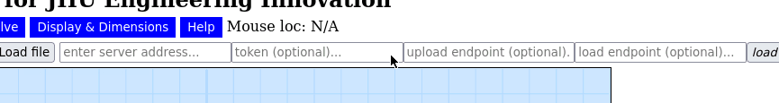
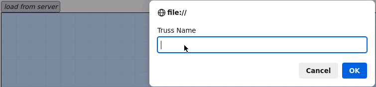

# jhu-ei-truss-simulator-save-extension
A bookmarklet to extend the [truss simulator](https://ei.jhu.edu/truss-simulator/) from JHU Engineering Innovation to send truss saves to a server.  
This project is not affiliated with Johns Hopkins University or the original creator of the truss simulator in any way.

## Requirements
- python3 (not required if only the bookmarklet is being used)

## Installation [](https://codespaces.new/ObjectOops/jhu-ei-truss-simulator-save-extension?quickstart=1) [](https://replit.com/github/ObjectOops/jhu-ei-truss-simulator-save-extension)
### Sample Backend
Add an authentication key to the server's configuration in `config.yml`.
```yml
key: "" # Insert your authenication key here.
```
Start the sample backend.
```sh
cd github_proxy_server && python3 server.py
```

> **Warning:** The server only has basic authentication and has not been tested for security. Be careful when exposing it publicly.

#### Enabling Version Control (git)
To enable version control, initialize a new repository inside `github_proxy_server`.  
Optionally, enable `auto_commit` in the server's configuration file to automatically commit each save.
```yml
auto_commit: true
```
#### Pushing to a Remote (git)
Add a remote to the repository from the previous section.  
Optionally, enable `auto_push` in the server's configuration file to automatically push each save.
```yml
auto_push: true # This will also enable auto_commit.
```
> Ensure that authentication to the remote occurs automatically.

> You can add remotes that aren't hosted on GitHub.
### Bookmarklet
Follow the instructions on the [releases](https://github.com/ObjectOops/jhu-ei-truss-simulator-save-extension/releases) page on GitHub.
### Offline Client
Download a local copy of the [truss simulator](https://ei.jhu.edu/truss-simulator/) and augment it with the extension. This requires a shell that supports process substitution, but can be modified to work with `sh`.
```bash
cd client_generator && ./generator.bash
```
Open `client_generator/ei.jhu.edu/truss-simulator/index.html` in a web browser and proceed past the confirmation prompt.

## Usage
All functions are avaiable under "Import & Export".
### Configuration
1. `server address`: The backend URL. This will be `http://localhost:5000` if the sample backend is running locally.
2. `token`: The key configured prior to starting the server.
3. `upload / load endpoint`: Any special endpoints for uploading or downloading. Leave these empty when using the sample backend.


### Saving
Save as file > enter a file name > upload to server.


### Loading
Load from server > enter a file name > submit.


